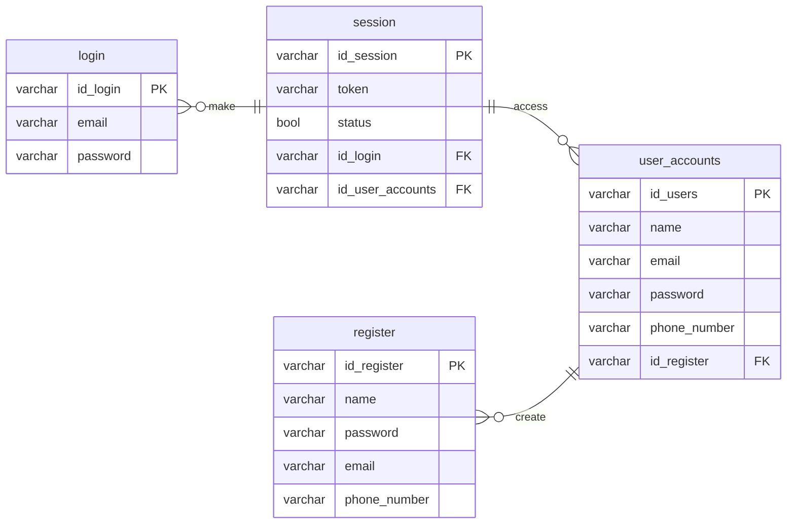

# Auth-FLOW

This project was made by Muhammad Davinda Rinaldy in Training Program held by Kodacademy to make ERD of authentication flow, using mermaid tool and make query (PostgreSQL) to create table and modifies it.

## Entity Relationship Diagram (ERD)

